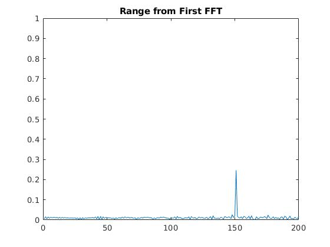

## Radar Target Generation and Detection

### Implementation

####  FMCW Waveform Design
Using the given system requirements, design  
a FMCW waveform. Find its Bandwidth (B), chirp time (Tchirp) and slope of the chirp.

```matlab
%% User Defined Range and Velocity of target
% *%TODO* :
% define the target's initial position and velocity. Note : Velocity
% remains contant

d_res = 1;
c = 3e8;
r_max = 200;

t_pos = 150; % meters
t_vel = 15; % m/s

%% FMCW Waveform Generation

% *%TODO* :
%Design the FMCW waveform by giving the specs of each of its parameters.
% Calculate the Bandwidth (B), Chirp Time (Tchirp) and Slope (slope) of the FMCW
% chirp using the requirements above.
B = c / (2 * d_res);
Tchirp = 5.5 * 2 * r_max / c;
slope = B / Tchirp;
```

####  Simulation Loop
Simulate Target movement and calculate the beat or mixed signal for every timestamp.

```matlab
%% Signal generation and Moving Target simulation
% Running the radar scenario over the time. 

for i=1:length(t)         
    
    
    % *%TODO* :
    %For each time stamp update the Range of the Target for constant velocity. 
    r_t(i) = t_pos + t_vel * t(i);
    td(i) = 2 * r_t(i) / c; 
    
    % *%TODO* :
    %For each time sample we need update the transmitted and
    %received signal. 
    Tx(i) = cos (2 * pi * (fc * t(i) + slope * (t(i)^2) / 2));
    t_diff = t(i) - td(i);
    Rx(i) = cos (2 * pi * (fc * t_diff + slope * (t_diff^2) / 2));
    
    % *%TODO* :
    %Now by mixing the Transmit and Receive generate the beat signal
    %This is done by element wise matrix multiplication of Transmit and
    %Receiver Signal
    Mix(i) = Tx(i) .* Rx(i);
    
end

```

####  Range FFT (1st FFT)
Implement the Range FFT on the Beat or Mixed Signal and plot the result.

```matlab
%% RANGE MEASUREMENT


 % *%TODO* :
%reshape the vector into Nr*Nd array. Nr and Nd here would also define the size of
%Range and Doppler FFT respectively.
signal = reshape(Mix, Nr, Nd);

 % *%TODO* :
%run the FFT on the beat signal along the range bins dimension (Nr) and
%normalize.
sig_fft = fft(signal, Nr);
sig_fft = sig_fft / Nr;

 % *%TODO* :
% Take the absolute value of FFT output
sig_fft = abs(sig_fft);

 % *%TODO* :
% Output of FFT is double sided signal, but we are interested in only one side of the spectrum.
% Hence we throw out half of the samples.
sig_fft = sig_fft(1:Nr/2 + 1);

%plotting the range
figure ('Name','Range from First FFT')
%subplot(2,1,1)

 % *%TODO* :
 % plot FFT output 
plot(sig_fft) 
axis ([0 200 0 1]);
title('Range from First FFT')
```



#####  Range Doppler Map output:


#### 2D CFAR
Implement the 2D CFAR process on the output of 2D FFT operation, i.e the Range Doppler Map.

Selection of Training, Guard cells and offset

   ```matlab
%% CFAR implementation

%Slide Window through the complete Range Doppler Map

% *%TODO* :
%Select the number of Training Cells in both the dimensions.
Tr = 10;
Td = 8;

% *%TODO* :
%Select the number of Guard Cells in both dimensions around the Cell under 
%test (CUT) for accurate estimation
Gr = 8;
Gd = 4; 

% *%TODO* :
% offset the threshold by SNR value in dB
offset = 10;
```


```matlab

% *%TODO* :
%design a loop such that it slides the CUT across range doppler map by
%giving margins at the edges for Training and Guard Cells.
%For every iteration sum the signal level within all the training
%cells. To sum convert the value from logarithmic to linear using db2pow
%function. Average the summed values for all of the training
%cells used. After averaging convert it back to logarithimic using pow2db.
%Further add the offset to it to determine the threshold. Next, compare the
%signal under CUT with this threshold. If the CUT level > threshold assign
%it a value of 1, else equate it to 0.
   % Use RDM[x,y] as the matrix from the output of 2D FFT for implementing
   % CFAR
   
signal_cfar = zeros(size(RDM));
threshold_cfar = zeros(size(RDM));
rdm_rows = size(RDM, 1);
rdm_cols = size(RDM, 2);
total_train_cells = (2 * (Tr + Gr) + 1) * (2 * (Td + Gd) + 1) - (2 * Gd + 1) * ( 2 * Gd + 1);

for i = Tr + Gr + 1:(rdm_rows - (Tr + Gr))
    for j=Td + Gd + 1:(rdm_cols - (Td + Gd))
        
        iitg = i - (Tr + Gr) : i + (Tr + Gr);
        jjtg = j - (Td + Gd) : j + (Td + Gd);
        nl_tg = sum(db2pow(RDM(iitg, jjtg)), 'all');
        
        iig = i - Gr : i + Gr;
        jjg = j - Gd : j + Gd;
        nl_g = sum(db2pow(RDM(iig, jjg)), 'all');
        
        noise_level = nl_tg - nl_g;
        threshold = pow2db(noise_level / total_train_cells);
        threshold = threshold + offset;
        threshold_cfar(i,j) = threshold;
        
        if (RDM(i,j) > threshold)
            signal_cfar(i,j) = 1;
        else
            % initializing the martix with zeros so this is not required
            % signal_cfar(i,j) = 0;
        end
        
    end
end

```
  


Steps taken to suppress the non-thresholded cells at the edges.

We initializing the output martix with zeros so this is not required as the values which are not updated are already set to zero.

#### CFAR Output Image


